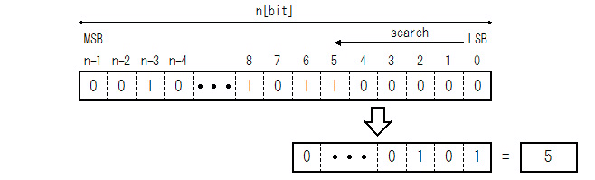

Generic Priority Encoder
========================


# Overview


## Introduction


Priority Encoder とは、あるビット列が与えられて、そのビット列をLSBまたはNSBから探索して最初に1だったところを見つけます。見つかった位置を数字(Binary Integer)で返すものを Priority Encoder と言います。また、数字で返さずに、入力されたビット列のうち、最初に1だったところのみ1にして後は全部0にして返す場合もあります。

この記事では、このPriority Encoder のビット列の大きさが Generic 変数で与えられた１ビット〜1024ビット超の可変値とした時のVHDL の記述方法と、それを論理合成した時の結果を示します。


## Licensing


二条項BSDライセンス (2-clause BSD license) で公開しています。


# Algorithm


## 1. For-loop with exit


VHDL の For-loop は exit 文でループを脱出することが出来ます。これを使って記述する方法です。


```VHDL:sample1.vhd
     procedure Priority_Encode_To_OneHot_Use_Exit(
                 Data        : in  std_logic_vector;
        variable Output      : out std_logic_vector;
        variable Valid       : out std_logic
    ) is
        variable result      :     std_logic_vector(Data'range);
    begin
        result := (others => '0');
        for i in Data'low to Data'high loop
            result(i) := Data(i);
            exit when (Data(i) = '1');
        end loop;
        Output := result;
        Valid  := or_reduce(Data);
    end procedure;

```


こんなの論理合成出来るの？　という疑問もありますが、意外と出来たりします。ただ、STARC の 『RTL 設計スタイルガイド』ではこの記述方法は「for-loop 文内で exit,next は使用しない」のが必須になっています。理由は論理合成ツールが生成するRTLのイメージが掴みにくいからですが、実はその通りで、論理合成ツールによって生成する回路が異なります。入力データのビット数が数ビットの場合は、この記述方法でも特に問題ありませんが、数十ビット以上になると論理合成ツールの出来次第みたいなところがあるので使用には注意が必要です。


## 2. For-loop with found flag


フラグを使って値を生成する方法です。found_1 フラグは false に初期化しておき、ループを使って入力データを探索し、最初に1を見つけたら found_1 フラグをセットしてそれ以降は全て0にします。


```VHDL:sample2.vhd
    procedure Priority_Encode_To_OneHot_Use_Flag(
                 Data        : in  std_logic_vector;
        variable Output      : out std_logic_vector;
        variable Valid       : out std_logic
    ) is
        variable result      :     std_logic_vector(Data'range);
        variable found_1     :     boolean;
    begin
        found_1 := false;
        for i in Data'low to Data'high loop
            if found_1 = false then
                result(i) := Data(i);
                found_1   := (Data(i) = '1');
            else
                result(i) := '0';
            end if;
        end loop;
        Output := result;
        Valid  := or_reduce(Data);
    end procedure;

```


## 3. For-loop with or-reduce


出力するビット列の個々のビットの立場になって、自分のビットに1が立つ条件を考えてみると、それは次の二つの条件を満たした場合であることが判ります。


1. 入力データの自分と同じ位置にあるビットが1の場合
2. 入力データの自分より前の位置のビットが全て0の場合


上の条件通りに VHDL を記述すると次のようになります。


```VHDL:sample3.vhd
    procedure Priority_Encode_To_OneHot_Use_OrReduce(
                 Data        : in  std_logic_vector;
        variable Output      : out std_logic_vector;
        variable Valid       : out std_logic
    ) is
        variable result      :     std_logic_vector(Data'range);
    begin
        for i in Data'range loop
            if (i = Data'low) then
                result(i) := Data(i);
            else
                result(i) := Data(i) and (not or_reduce(Data(i-1 downto Data'low)));
            end if;
        end loop;
        Output := result;
        Valid  := or_reduce(Data);
    end procedure;

```


ちなみに or_reduce とは与えられたビットすべてのor(論理和)をとります。したがって、ビットのどれかが1の場合に0になります。or_redeuce の not(否定)はビットの全てが0の場合に1になります。


## 4. Use Decriment


これは For-loop を使わずに加算器(減算器)を使って該当するビットのみ1にする方法です。


```VHDL:sample4.vhd
    procedure Priority_Encode_To_OneHot_Use_Decriment(
                 Data        : in  std_logic_vector;
        variable Output      : out std_logic_vector;
        variable Valid       : out std_logic
    ) is
        variable i_data      :     std_logic_vector(Data'length-1 downto 0);
        variable t_data      :     std_logic_vector(Data'length   downto 0);
        variable d_data      :     std_logic_vector(Data'length   downto 0);
        variable r_data      :     std_logic_vector(Data'length-1 downto 0);
        variable o_data      :     std_logic_vector(Data'range);
    begin
        i_data := Data;
        t_data := "0" & i_data;
        d_data := std_logic_vector(unsigned(t_data) - 1);
        r_data := i_data and not d_data(i_data'range);
        o_data := r_data;
        Valid  := or_reduce(i_data);
        Output := o_data;
    end procedure;
    
```


このアルゴリズムは、ループをまわさないので一見良さそうに見えます。もちろんコンピュータープログラムとしてはループを回すアルゴリズムに比べて高速に演算します。ただ、それはあくまでもコンピューターの場合であって、FPGAなどの論理回路の場合は意外と低速です。コンピューターにとって良いアルゴリズムが論理回路にとっては必ずしもそうでは無いという典型的な例と言えます。


## 5. Parallel and Recursive


1〜4で説明したアルゴリズムは、いずれも、入力データのビット長が大きいと、それだけ低速になります。何故なら、for-loop で回すにしても加算器を使うにしても、最上位ビットのデータを生成するために入力データの最下位ビットの情報を伝搬する必要があるからです。

ここではビット長がある程度大きい場合を想定して、並列処理することを考えましょう。主な考え方は次の図の通りです。




Fig.1 Parallel and Recursive Priority Encoder Diagram

<br />


このアルゴリズムでは、入力ビットをグループ毎に個別かつ並列にpriority encode します。また、priority encode を再帰的に処理します。

これを VHDL で記述すると次のようになります。


```VHDL:sample5.vhd
    procedure Priority_Encode_To_OneHot_Selectable(
                 Min_Dec_Len : in  integer;
                 Data        : in  std_logic_vector;
        variable Output      : out std_logic_vector;
        variable Valid       : out std_logic
    ) is
    begin
        if Data'length >= Min_Dec_Len then
            Priority_Encode_To_OneHot_Use_Decriment(Data,Output,Valid);
        else
            Priority_Encode_To_OneHot_Use_OrReduce(Data,Output,Valid);
        end if;
    end procedure;
    procedure Priority_Encode_To_OneHot_Use_RecursiveCall(
                 Min_Dec_Len : in  integer;
                 Max_Dec_Len : in  integer;
                 Data        : in  std_logic_vector;
        variable Output      : out std_logic_vector;
        variable Valid       : out std_logic
    ) is
        constant Dec_Num     :     integer := (Data'length+Max_Dec_Len-1)/Max_Dec_Len;
        constant Dec_Bits    :     integer := (Data'length+Dec_Num-1)/Dec_Num;
        variable result      :     std_logic_vector(Data'range);
        alias    i_data      :     std_logic_vector(Data'length-1 downto 0) is Data;
        variable o_data      :     std_logic_vector(Data'length-1 downto 0);
        variable o_valid     :     std_logic_vector(Dec_Num-1 downto 0);
        variable onehot      :     std_logic_vector(Dec_Num-1 downto 0);
    begin
        for i in 0 to Dec_Num-1 loop
            Priority_Encode_To_OneHot_Selectable(
                Min_Dec_Len => Min_Dec_Len,
                Data        => i_data(minimum(i_data'left, (i+1)*Dec_Bits-1) downto i*Dec_Bits),
                Output      => o_data(minimum(i_data'left, (i+1)*Dec_Bits-1) downto i*Dec_Bits),
                Valid       => o_valid(i)
            );
        end loop;
        if (Dec_Num > 1) then
            Priority_Encode_To_OneHot_Use_RecursiveCall(
                Min_Dec_Len => Min_Dec_Len,
                Max_Dec_Len => Max_Dec_Len,
                Data        => o_valid,
                Output      => onehot,
                Valid       => Valid
            );
            for i in 1 to Dec_Num-1 loop
                if (onehot(i) = '0') then
                    if (i = Dec_Num-1) then
                        o_data(o_data'left      downto i*Dec_Bits) := (others => '0');
                    else
                        o_data((i+1)*Dec_Bits-1 downto i*Dec_Bits) := (others => '0');
                    end if;
                end if;
            end loop;
        else
            Valid := o_valid(0);
        end if;
        Output := o_data;
    end procedure;
    
```


# Performance and Resource


## Vivado


### Performance


Xilinx社の Vivado(2015.4)で論理合成＆配置配線した時の性能を遅延時間で示します。遅延時間が大きいほど遅いことを示します。

ビット幅が64ビット以内であれば、各アルゴリズムの違いはそれほどありません。ビット幅がそれ以上になるとアルゴリズムでの違いが顕著になります。

Table.1 Performance (Vivado 2015.4)

<table border="2">
  <tr>
    <td align="center" colspan="2" rowspan="2">Device</td>
    <td align="center" rowspan="2">Parameter</td>
    <td align="center" colspan="5">Data Path Delay [nsec]</td>
  </tr>
  <tr>
    <td align="center" colspan="5">Algorithm</td>
  </tr>
  <tr>
    <td align="center">Family</td>
    <td align="center">Speed</td>
    <td align="center">WIDTH</td>
    <td align="center">1</td>
    <td align="center">2</td>
    <td align="center">3</td>
    <td align="center">4</td>
    <td align="center">5</td>
  </tr>
  <tr>
    <td rowspan="19">Zynq-7010</td>
    <td align="center" rowspan="19">1</td>
    <td align="center">4</td>
    <td align="right">1.335</td>
    <td align="right">1.470</td>
    <td align="right">1.435</td>
    <td align="right">1.435</td>
    <td align="right">1.435</td>
  </tr>
  <tr>
    <td align="center">8</td>
    <td align="right">1.901</td>
    <td align="right">1.882</td>
    <td align="right">1.882</td>
    <td align="right">1.882</td>
    <td align="right">1.882</td>
  </tr>
  <tr>
    <td align="center">12</td>
    <td align="right">1.975</td>
    <td align="right">1.975</td>
    <td align="right">1.975</td>
    <td align="right">2.436</td>
    <td align="right">1.975</td>
  </tr>
  <tr>
    <td align="center">16</td>
    <td align="right">2.117</td>
    <td align="right">2.154</td>
    <td align="right">1.989</td>
    <td align="right">2.565</td>
    <td align="right">1.989</td>
  </tr>
  <tr>
    <td align="center">32</td>
    <td align="right">2.848</td>
    <td align="right">2.641</td>
    <td align="right">2.690</td>
    <td align="right">3.184</td>
    <td align="right">3.184</td>
  </tr>
  <tr>
    <td align="center">48</td>
    <td align="right">3.024</td>
    <td align="right">2.880</td>
    <td align="right">3.133</td>
    <td align="right">3.676</td>
    <td align="right">3.676</td>
  </tr>
  <tr>
    <td align="center">64</td>
    <td align="right">3.315</td>
    <td align="right">3.743</td>
    <td align="right">3.307</td>
    <td align="right">3.949</td>
    <td align="right">3.949</td>
  </tr>
  <tr>
    <td align="center">96</td>
    <td align="right">4.595</td>
    <td align="right">5.442</td>
    <td align="right">3.622</td>
    <td align="right">4.844</td>
    <td align="right">3.518</td>
  </tr>
  <tr>
    <td align="center">128</td>
    <td align="right">4.548</td>
    <td align="right">4.472</td>
    <td align="right">4.628</td>
    <td align="right">6.100</td>
    <td align="right">4.488</td>
  </tr>
  <tr>
    <td align="center">160</td>
    <td align="right">4.671</td>
    <td align="right">4.697</td>
    <td align="right">4.756</td>
    <td align="right">7.041</td>
    <td align="right">4.642</td>
  </tr>
  <tr>
    <td align="center">192</td>
    <td align="right">5.624</td>
    <td align="right">4.857</td>
    <td align="right">4.976</td>
    <td align="right">7.971</td>
    <td align="right">4.757</td>
  </tr>
  <tr>
    <td align="center">224</td>
    <td align="right">5.433</td>
    <td align="right">5.075</td>
    <td align="right">4.928</td>
    <td align="right">8.803</td>
    <td align="right">4.907</td>
  </tr>
  <tr>
    <td align="center">256</td>
    <td align="right">5.974</td>
    <td align="right">5.096</td>
    <td align="right">5.020</td>
    <td align="right">9.542</td>
    <td align="right">4.954</td>
  </tr>
  <tr>
    <td align="center">384</td>
    <td align="right">6.512</td>
    <td align="right">5.188</td>
    <td align="right">5.648</td>
    <td align="right">13.336</td>
    <td align="right">5.340</td>
  </tr>
  <tr>
    <td align="center">512</td>
    <td align="right">7.844</td>
    <td align="right">5.909</td>
    <td align="right">6.125</td>
    <td align="right">20.222</td>
    <td align="right">5.795</td>
  </tr>
  <tr>
    <td align="center">1024</td>
    <td align="right">12.376</td>
    <td align="right">8.383</td>
    <td align="right">7.730</td>
    <td align="right">38.619</td>
    <td align="right">7.830</td>
  </tr>
  <tr>
    <td align="center">2048</td>
    <td align="right">25.479</td>
    <td align="right">9.306</td>
    <td align="right">-</td>
    <td align="right">77.770</td>
    <td align="right">8.765</td>
  </tr>
  <tr>
    <td align="center">3072</td>
    <td align="right">30.839</td>
    <td align="right">9.630</td>
    <td align="right">-</td>
    <td align="right">115.989</td>
    <td align="right">9.037</td>
  </tr>
  <tr>
    <td align="center">4096</td>
    <td align="right">43.213</td>
    <td align="right">9.746</td>
    <td align="right">-</td>
    <td align="right">156.031</td>
    <td align="right">9.333</td>
  </tr>
</table>


### Resource


Table.2 Resource (Vivado 2015.4)

<table border="2">
  <tr>
    <td align="center" colspan="2" rowspan="2">Device</td>
    <td align="center" rowspan="2">Parameter</td>
    <td align="center" colspan="5">Resource [LUTs]</td>
  </tr>
  <tr>
    <td align="center" colspan="5">Algorithm</td>
  </tr>
  <tr>
    <td align="center">Family</td>
    <td align="center">Speed</td>
    <td align="center">WIDTH</td>
    <td align="center">1</td>
    <td align="center">2</td>
    <td align="center">3</td>
    <td align="center">4</td>
    <td align="center">5</td>
  </tr>
  <tr>
    <td rowspan="19">Zynq-7010</td>
    <td align="center" rowspan="19">1</td>
    <td align="center">4</td>
    <td align="right">8</td>
    <td align="right">8</td>
    <td align="right">8</td>
    <td align="right">8</td>
    <td align="right">8</td>
  </tr>
  <tr>
    <td align="center">8</td>
    <td align="right">17</td>
    <td align="right">17</td>
    <td align="right">17</td>
    <td align="right">17</td>
    <td align="right">17</td>
  </tr>
  <tr>
    <td align="center">12</td>
    <td align="right">26</td>
    <td align="right">26</td>
    <td align="right">26</td>
    <td align="right">37</td>
    <td align="right">26</td>
  </tr>
  <tr>
    <td align="center">16</td>
    <td align="right">38</td>
    <td align="right">40</td>
    <td align="right">38</td>
    <td align="right">48</td>
    <td align="right">38</td>
  </tr>
  <tr>
    <td align="center">32</td>
    <td align="right">79</td>
    <td align="right">82</td>
    <td align="right">82</td>
    <td align="right">101</td>
    <td align="right">101</td>
  </tr>
  <tr>
    <td align="center">48</td>
    <td align="right">122</td>
    <td align="right">125</td>
    <td align="right">134</td>
    <td align="right">152</td>
    <td align="right">152</td>
  </tr>
  <tr>
    <td align="center">64</td>
    <td align="right">162</td>
    <td align="right">165</td>
    <td align="right">207</td>
    <td align="right">203</td>
    <td align="right">203</td>
  </tr>
  <tr>
    <td align="center">96</td>
    <td align="right">225</td>
    <td align="right">251</td>
    <td align="right">330</td>
    <td align="right">305</td>
    <td align="right">311</td>
  </tr>
  <tr>
    <td align="center">128</td>
    <td align="right">223</td>
    <td align="right">226</td>
    <td align="right">358</td>
    <td align="right">333</td>
    <td align="right">349</td>
  </tr>
  <tr>
    <td align="center">160</td>
    <td align="right">380</td>
    <td align="right">290</td>
    <td align="right">493</td>
    <td align="right">403</td>
    <td align="right">440</td>
  </tr>
  <tr>
    <td align="center">192</td>
    <td align="right">329</td>
    <td align="right">338</td>
    <td align="right">622</td>
    <td align="right">474</td>
    <td align="right">533</td>
  </tr>
  <tr>
    <td align="center">224</td>
    <td align="right">519</td>
    <td align="right">426</td>
    <td align="right">760</td>
    <td align="right">544</td>
    <td align="right">626</td>
  </tr>
  <tr>
    <td align="center">256</td>
    <td align="right">455</td>
    <td align="right">512</td>
    <td align="right">882</td>
    <td align="right">614</td>
    <td align="right">711</td>
  </tr>
  <tr>
    <td align="center">384</td>
    <td align="right">669</td>
    <td align="right">703</td>
    <td align="right">1665</td>
    <td align="right">896</td>
    <td align="right">1069</td>
  </tr>
  <tr>
    <td align="center">512</td>
    <td align="right">974</td>
    <td align="right">903</td>
    <td align="right">3023</td>
    <td align="right">1248</td>
    <td align="right">1426</td>
  </tr>
  <tr>
    <td align="center">1024</td>
    <td align="right">1823</td>
    <td align="right">1870</td>
    <td align="right">13542</td>
    <td align="right">2408</td>
    <td align="right">1987</td>
  </tr>
  <tr>
    <td align="center">2048</td>
    <td align="right">3531</td>
    <td align="right">3415</td>
    <td align="right">-</td>
    <td align="right">4715</td>
    <td align="right">3612</td>
  </tr>
  <tr>
    <td align="center">3072</td>
    <td align="right">5293</td>
    <td align="right">5050</td>
    <td align="right">-</td>
    <td align="right">7029</td>
    <td align="right">5424</td>
  </tr>
  <tr>
    <td align="center">4096</td>
    <td align="right">6949</td>
    <td align="right">6775</td>
    <td align="right">-</td>
    <td align="right">9349</td>
    <td align="right">7271</td>
  </tr>
</table>


### 1. For-loop with exit


このアルゴリズムは、入力データのビット幅が256ビット以内であれば他のアルゴリズムとそれほど遜色ない結果を示しました。しかし、それ以上のビット幅ではビット幅が増えるにつれて、急速に悪化しています。


### 2. For-loop with found flag


このアルゴリズムが、意外と健闘しています。性能や容量のどちらをみても他のアルゴリズムよりも良い結果を出しています。しかも5の並列化したアルゴリズムと遜色ない結果を出しています。気合い入れて並列化した記述をした身としては、ちょっとがっかりなほどです。


### 3. For-loop with or-reduce


このアルゴリズムは、実は入力データのビット数が2048ビットを超えると、 Vivado の論理合成が終了しませんでした。どうやらこのアルゴリズムは 　Vivado は不得意なようで、最適化がうまく働かないようです。しかしビット数が小さい場合は最適化が効くらしくそれなりの結果を出しています。


### 4. Use Decriment


このアルゴリズムは、Xilinx の FPGA ではあまりうまくいきませんでした。もともと FPGA の加算器はキャリーを伝搬する方式です。Xilinx の FPGA には、キャリー伝搬用の回路と配線は専用のものが用意されていてそれなりに高速なのですが、総遅延時間はビット数に比例するので、ビット数が大きいと、他のアルゴリズムに比べて目に見えて遅くなりました。

繰り返しますが、コンピューターにとって良いアルゴリズムが論理回路にとっては必ずしもそうでは無いという典型的な例と言えます。


### 5. Parallel and Recursive


2のアルゴリズムとそれほど変わらない結果でした。一応、最速な結果が出てますが、苦労した割りには感満載です。


## Quartus


Altera社の Quartus Prime (15.1) Light Editiionで論理合成＆配置配線した時の性能を動作周波数で示します。動作周波数が大きいほど速いことを示します。

Table.3 Performance (Quartus Prime 15.1 Light Edition)

<table border="2">
  <tr>
    <td align="center" colspan="2" rowspan="2">Device</td>
    <td align="center" rowspan="2">Parameter</td>
    <td align="center" colspan="5">Fmax(MHz) Slow 1100mV 85C Model</td>
  </tr>
  <tr>
    <td align="center" colspan="5">Algorithm</td>
  </tr>
  <tr>
    <td align="center">Family</td>
    <td align="center">Speed</td>
    <td align="center">WIDTH</td>
    <td align="center">1</td>
    <td align="center">2</td>
    <td align="center">3</td>
    <td align="center">4</td>
    <td align="center">5</td>
  </tr>
  <tr>
    <td rowspan="18">Cyclone V</td>
    <td align="center" rowspan="18"></td>
    <td align="center">4</td>
    <td align="right">811.69</td>
    <td align="right">811.69</td>
    <td align="right">811.69</td>
    <td align="right">811.69</td>
    <td align="right">811.69</td>
  </tr>
  <tr>
    <td align="center">8</td>
    <td align="right"></td>
    <td align="right">647.25</td>
    <td align="right">647.25</td>
    <td align="right">430.48</td>
    <td align="right">647.25</td>
  </tr>
  <tr>
    <td align="center">12</td>
    <td align="right">528.54</td>
    <td align="right">528.54</td>
    <td align="right">528.54</td>
    <td align="right">431.48</td>
    <td align="right">528.54</td>
  </tr>
  <tr>
    <td align="center">16</td>
    <td align="right">460.41</td>
    <td align="right">460.41</td>
    <td align="right">460.41</td>
    <td align="right">360.36</td>
    <td align="right">460.41</td>
  </tr>
  <tr>
    <td align="center">32</td>
    <td align="right">318.98</td>
    <td align="right">318.98</td>
    <td align="right">311.92</td>
    <td align="right">287.69</td>
    <td align="right">287.69</td>
  </tr>
  <tr>
    <td align="center">48</td>
    <td align="right">240.96</td>
    <td align="right">240.96</td>
    <td align="right">239.41</td>
    <td align="right">224.62</td>
    <td align="right">224.62</td>
  </tr>
  <tr>
    <td align="center">64</td>
    <td align="right">175.38</td>
    <td align="right">175.38</td>
    <td align="right">193.27</td>
    <td align="right">245.58</td>
    <td align="right">245.58</td>
  </tr>
  <tr>
    <td align="center">96</td>
    <td align="right">141.00</td>
    <td align="right">141.00</td>
    <td align="right">133.74</td>
    <td align="right">187.41</td>
    <td align="right">186.12</td>
  </tr>
  <tr>
    <td align="center">128</td>
    <td align="right">105.21</td>
    <td align="right">105.21</td>
    <td align="right">101.00</td>
    <td align="right">169.89</td>
    <td align="right">177.71</td>
  </tr>
  <tr>
    <td align="center">160</td>
    <td align="right">86.09</td>
    <td align="right">86.09</td>
    <td align="right">85.46</td>
    <td align="right">145.84</td>
    <td align="right">190.55</td>
  </tr>
  <tr>
    <td align="center">192</td>
    <td align="right">72.49</td>
    <td align="right">72.49</td>
    <td align="right">72.10</td>
    <td align="right">132.40</td>
    <td align="right">174.00</td>
  </tr>
  <tr>
    <td align="center">224</td>
    <td align="right">61.56</td>
    <td align="right">64.06</td>
    <td align="right">61.56</td>
    <td align="right">111.42</td>
    <td align="right">168.18</td>
  </tr>
  <tr>
    <td align="center">256</td>
    <td align="right">55.28</td>
    <td align="right">54.06</td>
    <td align="right">55.28</td>
    <td align="right">102.15</td>
    <td align="right">157.88</td>
  </tr>
  <tr>
    <td align="center">384</td>
    <td align="right">36.19</td>
    <td align="right">36.79</td>
    <td align="right">36.19</td>
    <td align="right">74.64</td>
    <td align="right">153.14</td>
  </tr>
  <tr>
    <td align="center">512</td>
    <td align="right">27.85</td>
    <td align="right">27.42</td>
    <td align="right">27.85</td>
    <td align="right">60.28</td>
    <td align="right">149.68</td>
  </tr>
  <tr>
    <td align="center">1024</td>
    <td align="right">13.80</td>
    <td align="right">14.14</td>
    <td align="right">-</td>
    <td align="right">32.07</td>
    <td align="right">129.85</td>
  </tr>
  <tr>
    <td align="center">2048</td>
    <td align="right">7.08</td>
    <td align="right">7.09</td>
    <td align="right">-</td>
    <td align="right">-</td>
    <td align="right">113.57</td>
  </tr>
  <tr>
    <td align="center">3072</td>
    <td align="right">4.62</td>
    <td align="right">-</td>
    <td align="right">-</td>
    <td align="right">-</td>
    <td align="right">-</td>
  </tr>
</table>


Table.4 Resource (Quartus Prime 15.1 Light Edition)

<table border="2">
  <tr>
    <td align="center" colspan="2" rowspan="2">Device</td>
    <td align="center" rowspan="2">Parameter</td>
    <td align="center" colspan="5">Resource [ALMs]</td>
  </tr>
  <tr>
    <td align="center" colspan="5">Algorithm</td>
  </tr>
  <tr>
    <td align="center">Family</td>
    <td align="center">Speed</td>
    <td align="center">WIDTH</td>
    <td align="center">1</td>
    <td align="center">2</td>
    <td align="center">3</td>
    <td align="center">4</td>
    <td align="center">5</td>
  </tr>
  <tr>
    <td rowspan="18">Cyclone V</td>
    <td align="center" rowspan="18"></td>
    <td align="center">4</td>
    <td align="right">1.8</td>
    <td align="right">1.8</td>
    <td align="right">1.8</td>
    <td align="right">1.8</td>
    <td align="right">1.8</td>
  </tr>
  <tr>
    <td align="center">8</td>
    <td align="right"></td>
    <td align="right">5.3</td>
    <td align="right">5.3</td>
    <td align="right">9.8</td>
    <td align="right">5.3</td>
  </tr>
  <tr>
    <td align="center">12</td>
    <td align="right">9.3</td>
    <td align="right">9.3</td>
    <td align="right">9.3</td>
    <td align="right">14.2</td>
    <td align="right">9.3</td>
  </tr>
  <tr>
    <td align="center">16</td>
    <td align="right">12.0</td>
    <td align="right">12.0</td>
    <td align="right">12.0</td>
    <td align="right">19.1</td>
    <td align="right">12.0</td>
  </tr>
  <tr>
    <td align="center">32</td>
    <td align="right">27.5</td>
    <td align="right">27.5</td>
    <td align="right">27.5</td>
    <td align="right">38.5</td>
    <td align="right">38.5</td>
  </tr>
  <tr>
    <td align="center">48</td>
    <td align="right">40.2</td>
    <td align="right">40.2</td>
    <td align="right">39.2</td>
    <td align="right">57.8</td>
    <td align="right">57.8</td>
  </tr>
  <tr>
    <td align="center">64</td>
    <td align="right">56.0</td>
    <td align="right">56.0</td>
    <td align="right">54.7</td>
    <td align="right">78.6</td>
    <td align="right">78.6</td>
  </tr>
  <tr>
    <td align="center">96</td>
    <td align="right">84.9</td>
    <td align="right">84.9</td>
    <td align="right">83.4</td>
    <td align="right">119.8</td>
    <td align="right">114.8</td>
  </tr>
  <tr>
    <td align="center">128</td>
    <td align="right">113.5</td>
    <td align="right">113.5</td>
    <td align="right">112.2</td>
    <td align="right">158.6</td>
    <td align="right">153.8</td>
  </tr>
  <tr>
    <td align="center">160</td>
    <td align="right">141.6</td>
    <td align="right">141.6</td>
    <td align="right">140.2</td>
    <td align="right">199.2</td>
    <td align="right">193.2</td>
  </tr>
  <tr>
    <td align="center">192</td>
    <td align="right">175.5</td>
    <td align="right">175.5</td>
    <td align="right">175.3</td>
    <td align="right">240.3</td>
    <td align="right">230.5</td>
  </tr>
  <tr>
    <td align="center">224</td>
    <td align="right">232.6</td>
    <td align="right">204.5</td>
    <td align="right">232.6</td>
    <td align="right">281.1</td>
    <td align="right">273.2</td>
  </tr>
  <tr>
    <td align="center">256</td>
    <td align="right">266.4</td>
    <td align="right">233.7</td>
    <td align="right">266.4</td>
    <td align="right">322.7</td>
    <td align="right">307.0</td>
  </tr>
  <tr>
    <td align="center">384</td>
    <td align="right">408.7</td>
    <td align="right">348.8</td>
    <td align="right">408.7</td>
    <td align="right">483.8</td>
    <td align="right">473.8</td>
  </tr>
  <tr>
    <td align="center">512</td>
    <td align="right">552.3</td>
    <td align="right">464.3</td>
    <td align="right">552.3</td>
    <td align="right">648.2</td>
    <td align="right">611.5</td>
  </tr>
  <tr>
    <td align="center">1024</td>
    <td align="right">1066.3</td>
    <td align="right">921.7</td>
    <td align="right">41690.5</td>
    <td align="right">1309.6</td>
    <td align="right">1244.8</td>
  </tr>
  <tr>
    <td align="center">2048</td>
    <td align="right">2120.0</td>
    <td align="right">1836.7</td>
    <td align="right">-</td>
    <td align="right">2313.7</td>
    <td align="right">2479.7</td>
  </tr>
  <tr>
    <td align="center">3072</td>
    <td align="right">3169.4</td>
    <td align="right">-</td>
    <td align="right">-</td>
    <td align="right">-</td>
    <td align="right">-</td>
  </tr>
</table>


### 1. For-loop with exit


### 2. For-loop with found flag


### 3. For-loop with or-reduce


Quartus では、上の3つのアルゴリズムでの違いはほとんどありませんでした。ビット幅が大きくなるのと比例して遅延時間が増えています。おそらく、Quartus はあまりこの手の For-loop の最適化が Vivado に比べて上手くないようです。


### 4. Use Decriment


Altera の FPGA もキャリー伝搬方式の加算器です。キャリー伝搬用の回路と配線は専用のものが用意されていてそれなりに高速なのですが、総遅延時間はビット数に比例するので、ビット数が大きいとそれに比例して遅くなっています。

ただ、Xilinx の Vivado の場合と異なり、For-loop の最適化がダメダメなので、それに比較するとマシな結果を出しています。


### 5. Parallel and Recursive


Altera の場合は、並列化の記述がよく効きました。頑張って書いた甲斐がありました。


# Commnet


このような単純な回路でも、記述方法によって、また使用するデバイスやツールによって異なる結果がでました。どれか一つに絞るのではなく、用途に応じて記述方法を変えるくらいの工夫が必要でしょう。


